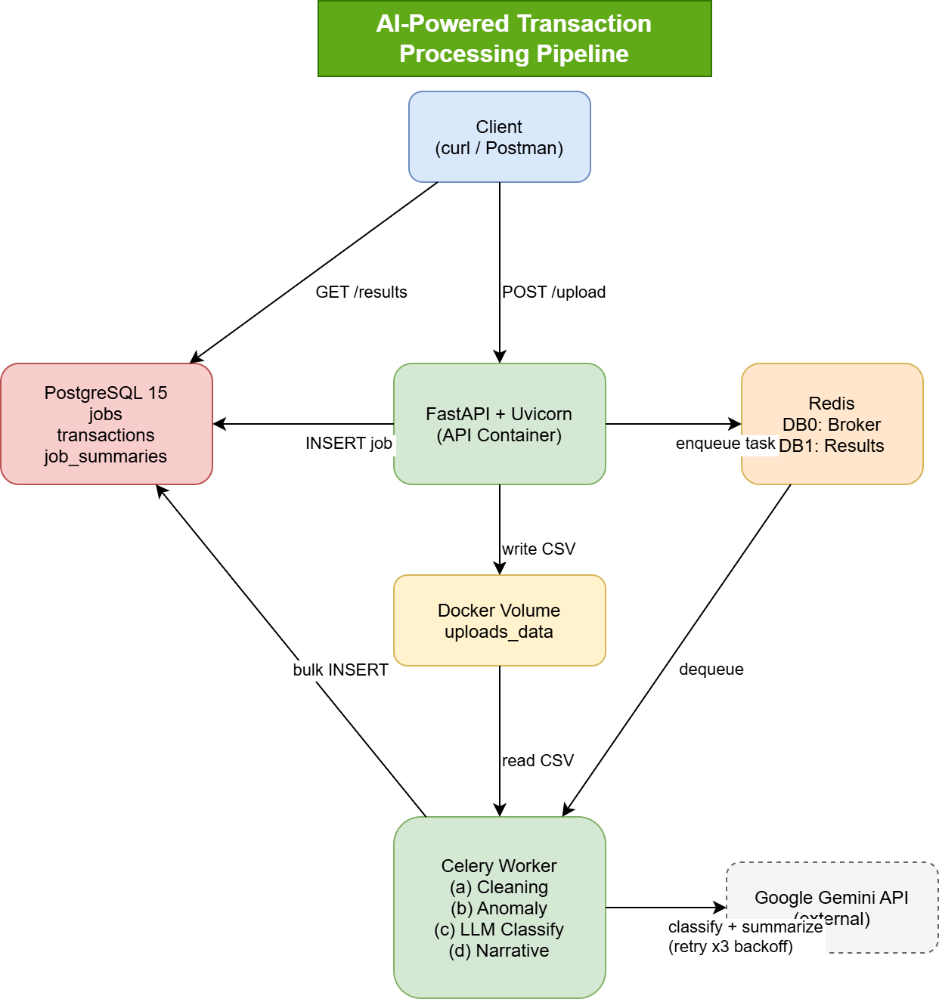

# AI-Powered Transaction Processing Pipeline

> Backend + DevOps Internship Assignment — Alemeno

A production-grade asynchronous backend API that ingests dirty financial transaction CSVs, processes them through a multi-stage pipeline (cleaning → anomaly detection → LLM classification → narrative summary), and exposes structured results via a polling API.

Built with **FastAPI**, **Celery**, **Redis**, **PostgreSQL**, and **Google Gemini AI** — fully containerised with **Docker Compose**.

---

## Architecture



> *Full diagram available on [draw.io](https://drive.google.com/your-diagram-link-here)*

```
Client (curl / Postman)
        │
        ▼
┌───────────────────┐     ┌─────────────────┐
│   FastAPI + Uvicorn│────▶│  Redis (Broker) │
│   (API Container) │     │  DB0: tasks     │
└───────────────────┘     │  DB1: results   │
        │                 └────────┬────────┘
        │ writes CSV                │ dequeues
        ▼                          ▼
┌───────────────────┐     ┌─────────────────┐
│  Docker Volume    │────▶│  Celery Worker  │
│  (uploads_data)   │     │  (a) Cleaning   │
└───────────────────┘     │  (b) Anomaly    │
                          │  (c) LLM Classify│
        ┌─────────────────│  (d) Narrative  │
        │                 └────────┬────────┘
        ▼                          │ bulk insert
┌───────────────────┐              │
│  Google Gemini API│◀─────────────┘
│  (external)       │
└───────────────────┘
        │
        ▼
┌───────────────────┐
│  PostgreSQL 15    │
│  jobs             │
│  transactions     │
│  job_summaries    │
└───────────────────┘
```

---

## Tech Stack

| Component | Technology |
|---|---|
| API Framework | FastAPI 0.111 + Uvicorn |
| Task Queue | Celery 5.3 + Redis 7 |
| Database | PostgreSQL 15 + SQLAlchemy 2.0 (async) |
| Migrations | Alembic |
| LLM | Google Gemini 1.5 Flash |
| Data Processing | Pandas 2.2 |
| Validation | Pydantic v2 |
| Containerisation | Docker + Docker Compose |

---

## Project Structure

```
backend-devops-assignment/
├── app/
│   ├── api/
│   │   └── routes/
│   │       └── jobs.py          # All 4 API endpoints
│   ├── core/
│   │   ├── exceptions.py        # Global error handlers
│   │   └── logging.py           # Structured JSON logging
│   ├── models/
│   │   ├── job.py               # Job ORM model
│   │   ├── transaction.py       # Transaction ORM model
│   │   └── job_summary.py       # JobSummary ORM model
│   ├── schemas/
│   │   ├── job.py               # Pydantic request/response schemas
│   │   └── transaction.py       # Transaction + results schemas
│   ├── services/
│   │   ├── csv_validator.py     # File validation (extension, size, headers)
│   │   ├── cleaning.py          # Data cleaning pipeline
│   │   ├── anomaly.py           # Anomaly detection (statistical + rule-based)
│   │   └── llm_client.py        # Gemini wrapper + retry + fallback
│   ├── workers/
│   │   ├── celery_app.py        # Celery instance configuration
│   │   └── tasks.py             # process_job task (full pipeline)
│   ├── config.py                # Pydantic Settings (env vars)
│   ├── database.py              # Async engine, session, Base
│   └── main.py                  # FastAPI app + lifespan + middleware
├── alembic/
│   ├── versions/
│   │   └── 0001_initial_schema.py
│   └── env.py
├── scripts/
│   └── start.sh                 # Runs migrations then starts Uvicorn
├── docs/
│   └── architecture.png         # System architecture diagram
├── docker-compose.yml
├── Dockerfile.api
├── Dockerfile.worker
├── requirements.txt
├── alembic.ini
└── .env.example
```

---

## Quickstart

### Prerequisites

- [Docker Desktop](https://www.docker.com/products/docker-desktop/) installed and running
- Google Gemini API key (free tier): [aistudio.google.com/app/apikey](https://aistudio.google.com/app/apikey)

### 1. Clone the repository

```bash
git clone https://github.com/your-username/backend-devops-assignment.git
cd backend-devops-assignment
```

### 2. Configure environment variables

```bash
cp .env.example .env
```

Open `.env` and set your Gemini API key:

```bash
GEMINI_API_KEY=your_actual_key_here
```

All other values are pre-configured for the Docker Compose network and require no changes for local development.

### 3. Start the entire stack

```bash
docker compose up --build
```

This single command:
- Starts PostgreSQL, Redis, the API server, and the Celery worker
- Runs Alembic database migrations automatically
- Creates all tables before the API accepts traffic

Wait for both:
```
api-1     | Application startup complete.
worker-1  | celery@... ready.
```

The API is available at: **`http://localhost:8000`**

Interactive docs (Swagger UI): **`http://localhost:8000/docs`**

---

## Environment Variables

| Variable | Description | Default |
|---|---|---|
| `POSTGRES_USER` | PostgreSQL username | `txnuser` |
| `POSTGRES_PASSWORD` | PostgreSQL password | `txnpassword` |
| `POSTGRES_DB` | Database name | `txndb` |
| `POSTGRES_HOST` | DB host (Docker service name) | `postgres` |
| `POSTGRES_PORT` | DB port | `5432` |
| `REDIS_HOST` | Redis host (Docker service name) | `redis` |
| `REDIS_PORT` | Redis port | `6379` |
| `CELERY_BROKER_URL` | Celery broker URL | `redis://redis:6379/0` |
| `CELERY_RESULT_BACKEND` | Celery results URL | `redis://redis:6379/1` |
| `GEMINI_API_KEY` | **Required.** Google Gemini API key | — |
| `GEMINI_MODEL` | Gemini model name | `gemini-1.5-flash` |
| `MAX_UPLOAD_SIZE_BYTES` | Maximum CSV upload size | `10485760` (10 MB) |
| `UPLOAD_DIR` | CSV storage path inside container | `/app/uploads` |
| `LOG_LEVEL` | Logging verbosity | `INFO` |
| `APP_ENV` | Environment name | `development` |

---

## API Endpoints

| Method | Endpoint | Description |
|---|---|---|
| `POST` | `/jobs/upload` | Upload a CSV file and queue processing |
| `GET` | `/jobs/{job_id}/status` | Poll job state (pending → processing → completed) |
| `GET` | `/jobs/{job_id}/results` | Fetch full structured results |
| `GET` | `/jobs` | List all jobs (`?status=` filter supported) |
| `GET` | `/health` | Liveness probe |

---

## Example curl Requests

### Upload a CSV

```bash
curl -X POST http://localhost:8000/jobs/upload \
  -F "file=@transactions.csv"
```

```json
{
  "job_id": "3c94641a-e4c8-441e-8113-00de6136485d",
  "status": "pending",
  "message": "Job queued successfully. Poll GET /jobs/3c94641a-.../status for updates."
}
```

### Poll Status

```bash
curl http://localhost:8000/jobs/3c94641a-e4c8-441e-8113-00de6136485d/status
```

```json
{
  "job_id": "3c94641a-e4c8-441e-8113-00de6136485d",
  "status": "completed",
  "filename": "transactions.csv",
  "row_count_raw": 95,
  "row_count_clean": 85,
  "created_at": "2024-07-15T10:30:00Z",
  "completed_at": "2024-07-15T10:30:42Z",
  "summary": {
    "total_spend_inr": 847413.48,
    "total_spend_usd": 74185.14,
    "anomaly_count": 10,
    "risk_level": "high",
    "narrative": "This account shows heavy spending across transport and utilities...",
    "top_merchants": [...]
  }
}
```

### Get Full Results

```bash
curl http://localhost:8000/jobs/3c94641a-e4c8-441e-8113-00de6136485d/results
```

```json
{
  "job_id": "3c94641a-...",
  "status": "completed",
  "transactions": [ ... ],
  "anomalies": [
    {
      "txn_id": "TXN2002",
      "merchant": "Ola",
      "amount": "91185.10",
      "currency": "INR",
      "is_anomaly": true,
      "anomaly_reason": "Amount 91185.10 exceeds 3x account median 5413.62 for account ACC001"
    }
  ],
  "category_breakdown": [
    { "category": "Food", "total_amount": "65322.66", "transaction_count": 8, "currency": "INR" },
    { "category": "Shopping", "total_amount": "125532.98", "transaction_count": 17, "currency": "INR" }
  ],
  "summary": { ... }
}
```

### List All Jobs

```bash
# All jobs
curl http://localhost:8000/jobs

# Filter by status
curl "http://localhost:8000/jobs?status=completed"
curl "http://localhost:8000/jobs?status=failed"
```

---

## Processing Pipeline

When a CSV is uploaded, the Celery worker executes these steps in order:

### (a) Data Cleaning
- Normalises mixed date formats (`DD-MM-YYYY` and `YYYY/MM/DD`) → ISO 8601
- Strips `$` prefix from amounts, converts to `Decimal`
- Uppercases `status` (success → SUCCESS) and `currency` (inr → INR)
- Fills blank `category` with `Uncategorised`
- Removes exact duplicate rows
- Generates surrogate `GEN-XXXXXXXX` IDs for rows with blank `txn_id`

### (b) Anomaly Detection
Two independent rules — a transaction can be flagged by both:

1. **Statistical outlier**: `amount > 3× median` of the account's transaction amounts (computed per `account_id`)
2. **Currency mismatch**: `currency = USD` but merchant is a domestic-only brand (Swiggy, Ola, IRCTC, Zomato, Jio Recharge, BookMyShow, HDFC ATM)

### (c) LLM Classification
- Uncategorised transactions are batched (max 30 per call) and sent to Gemini in a single structured prompt
- Valid categories: `Food`, `Shopping`, `Travel`, `Transport`, `Utilities`, `Cash Withdrawal`, `Entertainment`, `Other`
- Prompt injection is prevented by sanitizing all CSV field values before insertion into prompts

### (d) LLM Narrative Summary
- Single Gemini call generates: total spend by currency, top 3 merchants, anomaly count, 2–3 sentence narrative, `risk_level` (low/medium/high)
- Stored as a `JobSummary` record linked to the job

### (e) Retry Logic
- All LLM calls retry up to **3 times** with **exponential backoff** (2s → 4s → 8s) via `tenacity`
- If all retries fail: affected transactions are marked `llm_failed=True`
- A **computed fallback summary** is generated from the data — the job always reaches `completed`
- LLM failures never fail the entire job

---

## Database Schema

```
jobs
  id (UUID PK), filename, status, row_count_raw, row_count_clean
  created_at, completed_at, error_message

transactions
  id (UUID PK), job_id (FK → jobs), txn_id, date, merchant
  amount (Numeric), currency, txn_status, category, account_id, notes
  is_anomaly, anomaly_reason, llm_category, llm_raw_response, llm_failed

job_summaries
  id (UUID PK), job_id (FK → jobs, UNIQUE)
  total_spend_inr, total_spend_usd, top_merchants (JSON)
  anomaly_count, narrative, risk_level, created_at
```

---

## Troubleshooting

**Worker exits immediately on startup**
```bash
docker compose logs worker | tail -20
```
→ Usually a missing or invalid `GEMINI_API_KEY` in `.env`.

**`summary` is null in results**
```bash
docker compose logs worker | grep -i "error\|gemini\|llm"
```
→ LLM calls failing. Check Gemini API key. Fallback summary should still appear.

**Tables not created / migration errors**
```bash
docker compose logs api | grep -i "alembic\|error"
```
→ PostgreSQL may not have been ready. Run `docker compose down -v && docker compose up --build`.

**`connection refused` on API startup**
→ PostgreSQL healthcheck hasn't passed yet. Wait 15–20 seconds and retry.

**Full reset**
```bash
docker compose down -v
docker compose up --build
```

---

## Assumptions

1. **Date format detection** is based on separator character: `-` → `DD-MM-YYYY`, `/` → `YYYY/MM/DD`
2. **Duplicate detection** means exact full-row duplicates only (all columns identical), not fuzzy/partial duplicates
3. **`notes` field values** (`SUSPICIOUS`, `Duplicate?`) are stored as-is — they are not used as the sole basis for anomaly flags; anomalies are independently computed
4. **Per-account median** is computed over cleaned, valid (non-null, positive) amounts only
5. **LLM classifies only** rows where `category` is blank or `Uncategorised` — existing categories are preserved
6. **`txn_id` blanks** receive a surrogate `GEN-XXXXXXXX` ID for internal tracking; original blank is not preserved

---

## Future Improvements

| Area | Improvement |
|---|---|
| Scale | Replace local file storage with S3/object storage for multi-replica deployments |
| Scale | Run Alembic migrations as a separate init container, not on every API startup |
| Security | Implement API key authentication on all endpoints |
| Performance | Add Redis caching for repeated category lookups (same merchant → same category) |
| Observability | Add Prometheus metrics endpoint + Grafana dashboard |
| Reliability | Use Redis `SETNX` distributed lock in worker for true idempotency |
| DX | Add `pytest` test suite with mocked LLM calls |

---

## Submission

- **GitHub Repository**: [github.com/your-username/backend-devops-assignment](https://github.com/your-username/backend-devops-assignment)
- **Architecture Diagram**: [draw.io link]
- **Technical Review Video**: [Loom/Zoom link]